# Car Rental System — Complete System Documentation

**Project Name:** DriveGo Car Rental Platform  
**Version:** 1.0  
**Database:** Supabase (PostgreSQL)  
**Framework:** Next.js 16 (App Router)  
**Target:** Final Year Project Documentation  

---

## Table of Contents

1. [System Overview](#1-system-overview)
2. [Technology Stack & Tools](#2-technology-stack--tools)
3. [System Architecture](#3-system-architecture)
4. [Authentication & Verification Flow](#4-authentication--verification-flow)
5. [Role-Based Access Control](#5-role-based-access-control)
6. [Use Case Diagram](#6-use-case-diagram)
7. [Class Diagram](#7-class-diagram)
8. [Customer Journey — Sequence Diagrams](#8-customer-journey--sequence-diagrams)
9. [Admin Workflows — Sequence Diagrams](#9-admin-workflows--sequence-diagrams)
10. [Complete Booking Flow](#10-complete-booking-flow)
11. [Database Schema & Design](#11-database-schema--design)
12. [Application Routes & Features](#12-application-routes--features)
13. [Payment Methods (Current Implementation)](#13-payment-methods-current-implementation)
14. [Future Scope — Payment Integration](#14-future-scope--payment-integration)
15. [How to Use This Documentation](#15-how-to-use-this-documentation)

---

## 1. System Overview

DriveGo is a modern web-based car rental platform designed for a Cameroon-based business operating across three physical branch locations: **Douala (Akwa)**, **Douala International Airport**, and **Yaoundé (Bastos)**. The system streamlines the entire vehicle rental lifecycle from browsing to return.

### System Purpose

The platform serves three types of users — **customers**, **staff**, and **administrators** — each with distinct capabilities. It supports:

- **Public vehicle browsing** with advanced filtering (category, fuel type, price range, availability)
- **Multi-step online booking** with date/location selection and dynamic pricing
- **Payment recording** for card, mobile money (MTN/Orange), and cash transactions
- **Administrative approval workflows** for booking verification and dispatch
- **Fleet management** with vehicle CRUD operations and Cloudinary image uploads
- **Customer management** with booking history and profile tracking
- **Revenue analytics** and reporting dashboards
- **Contact form** inquiry management

---

## 2. Technology Stack & Tools

### Frontend
| Library | Version | Purpose |
|---|---|---|
| Next.js | 16.2.4 | Full-stack React framework (App Router) |
| React | 19.2.4 | UI rendering |
| TypeScript | 5 | Static typing |
| TailwindCSS | 4 | Utility-first styling |
| Radix UI (shadcn/ui) | Various | Accessible UI components |
| React Hook Form | 7.73.1 | Form state management |
| Zod | 4.3.6 | Form validation schemas |
| Recharts | 3.8.1 | Revenue charts and analytics |
| React Day Picker | 9.14.0 | Date range selection |
| Phosphor Icons | 2.1.10 | Icon library |
| Sonner | 2.0.7 | Toast notifications |
| TanStack React Query | 5.100.1 | Client-side data fetching |
| React Phone Number Input | 3.4.16 | Formatted phone fields |
| Country State City | 3.2.1 | Location selectors |
| Date-fns | 4.1.0 | Date utilities |

### Backend & Services
| Service | Version | Purpose |
|---|---|---|
| Supabase (PostgreSQL) | — | Database, Auth, RLS |
| @supabase/ssr | 0.10.2 | Server-side session management |
| @supabase/supabase-js | 2.104.1 | JavaScript client |
| Next.js Server Actions | — | Server-side mutations |
| Cloudinary | — | Vehicle image upload and CDN storage |

### Tooling
| Tool | Purpose |
|---|---|
| ESLint 9 | Code linting |
| PostCSS | CSS processing |
| TypeScript compiler | Type checking |

### Development Tools Recommended
| Software | Purpose |
|---|---|
| VS Code | Primary IDE with Mermaid Preview extension |
| Git | Version control |
| Node.js 20+ | JavaScript runtime |
| npm / yarn | Package management |
| Supabase CLI | Database migrations and management |
| Postman / Insomnia | API testing (for future payment integrations) |

---

## 3. System Architecture

The application follows a modern serverless three-tier architecture with Next.js App Router, Supabase backend services, and Cloudinary media CDN.

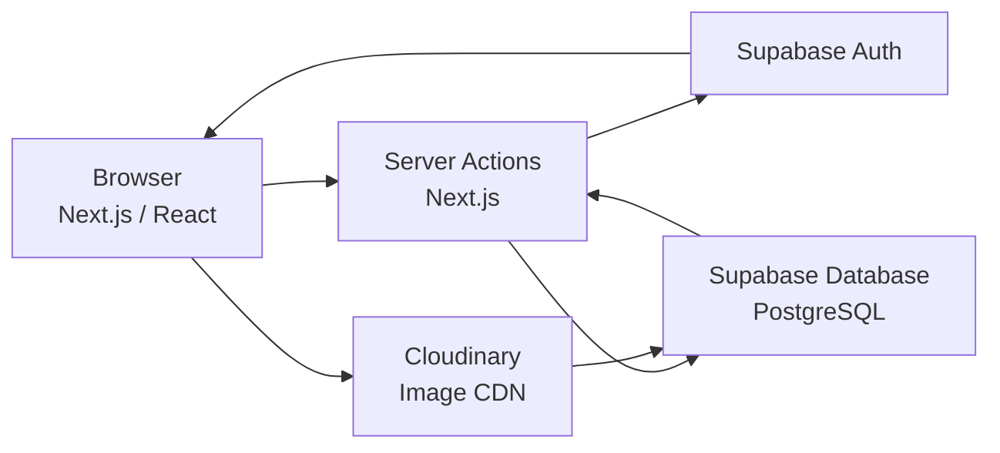
```mermaid
graph LR
    A[Browser\nNext.js / React]
    B[Server Actions\nNext.js]
    C[Supabase Auth]
    D[Supabase Database\nPostgreSQL]
    E[Cloudinary\nImage CDN]

    A --> B
    B --> C
    B --> D
    A --> E
    E --> D
    C --> A
    D --> B
```

### Architecture Components

**Frontend Layer**
- Next.js 16 App Router with React 19 for server-side rendering and client-side hydration
- TailwindCSS 4 for utility-first styling with custom component themes
- Radix UI primitives (via shadcn/ui) for accessible, unstyled component foundation
- Recharts for revenue analytics visualization
- React Query for client-side data fetching and caching

**Backend Layer**
- Next.js Server Actions replace traditional REST APIs for type-safe server operations
- Server-side session management via Supabase SSR with HTTP-only cookies
- Row Level Security (RLS) policies enforce data access rules at database level
- Admin client bypass for staff operations requiring elevated permissions

**Database Layer**
- Supabase PostgreSQL with PostGIS extension support (for future GPS tracking)
- Database triggers for automated profile creation and timestamp updates
- Check constraints for data integrity (dates, enums, pricing)
- Indexed columns for performance on booking date range queries

**External Services**
- Cloudinary CDN for vehicle image storage and transformation
- Supabase Auth for email/password authentication and email verification
- Supabase Realtime for live booking updates (future websocket integration)

---

## 4. Authentication & Verification Flow

The system uses Supabase Auth with email verification and automatic profile creation via database triggers.

### 4.1 Registration Sequence

The registration flow uses a two-step form (personal details + document verification) and triggers automatic profile creation through database triggers.

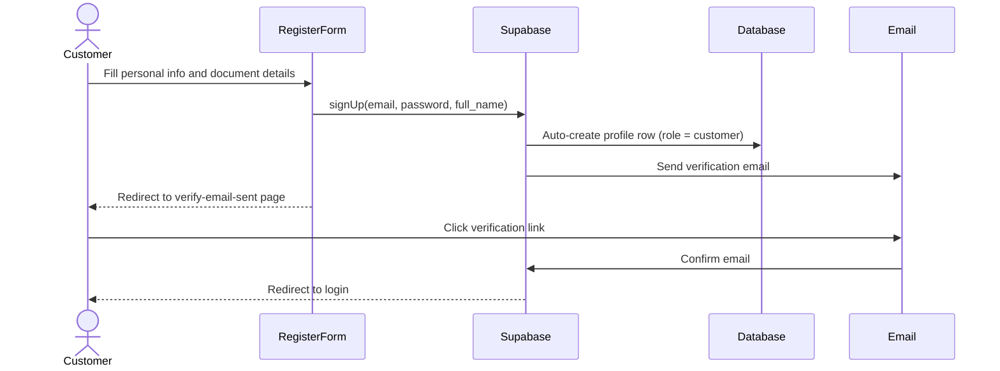
```mermaid
sequenceDiagram
    actor Customer
    participant RegisterForm
    participant Supabase
    participant Database
    participant Email

    Customer->>RegisterForm: Fill personal info and document details
    RegisterForm->>Supabase: signUp(email, password, full_name)
    Supabase->>Database: Auto-create profile row (role = customer)
    Supabase->>Email: Send verification email
    RegisterForm-->>Customer: Redirect to verify-email-sent page
    Customer->>Email: Click verification link
    Email->>Supabase: Confirm email
    Supabase-->>Customer: Redirect to login
```

**Registration Steps Explained:**

1. User fills **PersonalInfoStep** with name, email, phone, driver's license number, and password
2. User completes **DocumentVerificationStep** with national ID/passport upload
3. Server action calls Supabase Auth `signUp()` with user metadata
4. Database trigger `handle_new_user()` fires automatically, inserting a matching row in `profiles` table with `role='customer'`
5. Admin client bypass updates additional fields (phone, license_number) to avoid RLS restrictions
6. Verification email sent with secure token link pointing to `/auth/callback`
7. User clicks link, session cookie created, user redirected to login

### 4.2 Login Sequence

Login checks email verification status and redirects based on user role (customer vs admin/staff).

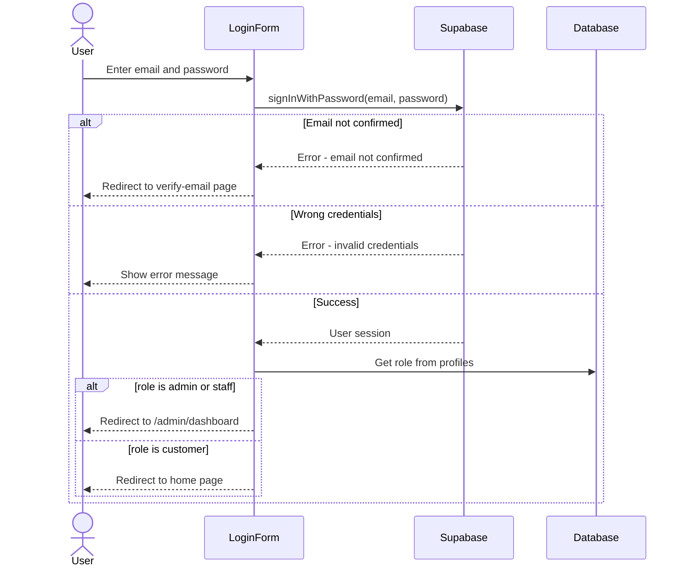
```mermaid
sequenceDiagram
    actor User
    participant LoginForm
    participant Supabase
    participant Database

    User->>LoginForm: Enter email and password
    LoginForm->>Supabase: signInWithPassword(email, password)

    alt Email not confirmed
        Supabase-->>LoginForm: Error - email not confirmed
        LoginForm-->>User: Redirect to verify-email page
    else Wrong credentials
        Supabase-->>LoginForm: Error - invalid credentials
        LoginForm-->>User: Show error message
    else Success
        Supabase-->>LoginForm: User session
        LoginForm->>Database: Get role from profiles
        alt role is admin or staff
            LoginForm-->>User: Redirect to /admin/dashboard
        else role is customer
            LoginForm-->>User: Redirect to home page
        end
    end
```

**Login Logic:**

1. User enters email and password
2. Supabase Auth validates credentials
3. If email not confirmed, redirect to email verification page with resend option
4. If credentials invalid, display error toast
5. On success, query `profiles` table to fetch user's role
6. Role-based redirect:
   - **admin** or **staff** → `/admin/dashboard`
   - **customer** → `/` (homepage)

### 4.3 Session Management & Logout

Sessions are maintained using HTTP-only cookies managed by Supabase SSR.

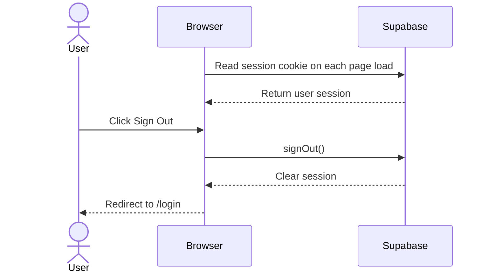
```mermaid
sequenceDiagram
    actor User
    participant Browser
    participant Supabase

    Browser->>Supabase: Read session cookie on each page load
    Supabase-->>Browser: Return user session
    User->>Browser: Click Sign Out
    Browser->>Supabase: signOut()
    Supabase-->>Browser: Clear session
    Browser-->>User: Redirect to /login
```

**Session Details:**

- Every page load reads the session cookie via Supabase SSR client
- JWT token validated on server-side for protected routes
- Sign out clears the cookie and redirects to `/login`
- Session automatically refreshes before expiry

---

## 5. Role-Based Access Control

Three roles enforce different permission levels across the system.

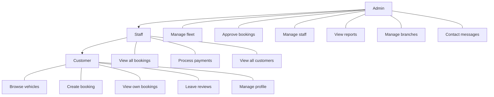
```mermaid
graph TD
    Admin --> Staff
    Staff --> Customer

    Admin --- A1[Manage fleet]
    Admin --- A2[Approve bookings]
    Admin --- A3[Manage staff]
    Admin --- A4[View reports]
    Admin --- A5[Manage branches]
    Admin --- A6[Contact messages]

    Staff --- S1[View all bookings]
    Staff --- S2[Process payments]
    Staff --- S3[View all customers]

    Customer --- C1[Browse vehicles]
    Customer --- C2[Create booking]
    Customer --- C3[View own bookings]
    Customer --- C4[Leave reviews]
    Customer --- C5[Manage profile]
```

### Permissions Matrix

| Capability | Customer | Staff | Admin |
|---|:---:|:---:|:---:|
| Browse vehicles (public) | ✓ | ✓ | ✓ |
| Create a booking | ✓ | ✓ | ✓ |
| View own bookings | ✓ | ✓ | ✓ |
| Cancel own pending bookings | ✓ | ✓ | ✓ |
| Leave vehicle reviews | ✓ | ✓ | ✓ |
| Manage own profile | ✓ | ✓ | ✓ |
| View ALL bookings | ✗ | ✓ | ✓ |
| Process / verify payments | ✗ | ✓ | ✓ |
| View all customers | ✗ | ✓ | ✓ |
| Access admin dashboard | ✗ | ✓ | ✓ |
| Add / edit / delete vehicles | ✗ | ✗ | ✓ |
| Approve / dispatch bookings | ✗ | ✗ | ✓ |
| Manage staff & roles | ✗ | ✗ | ✓ |
| Manage branches | ✗ | ✗ | ✓ |
| View revenue reports | ✗ | ✗ | ✓ |
| Manage contact messages | ✗ | ✗ | ✓ |

---

## 6. Use Case Diagram

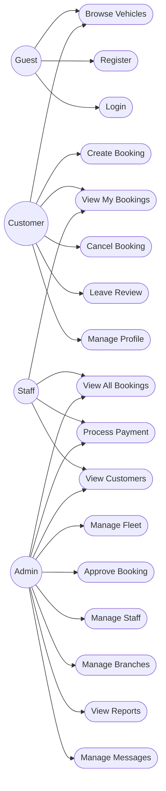
```mermaid
graph LR
    Guest((Guest))
    Customer((Customer))
    Staff((Staff))
    Admin((Admin))

    Guest --> UC1([Browse Vehicles])
    Guest --> UC2([Register])
    Guest --> UC3([Login])

    Customer --> UC1
    Customer --> UC4([Create Booking])
    Customer --> UC5([View My Bookings])
    Customer --> UC6([Cancel Booking])
    Customer --> UC7([Leave Review])
    Customer --> UC8([Manage Profile])

    Staff --> UC5
    Staff --> UC9([View All Bookings])
    Staff --> UC10([Process Payment])
    Staff --> UC11([View Customers])

    Admin --> UC9
    Admin --> UC10
    Admin --> UC11
    Admin --> UC12([Manage Fleet])
    Admin --> UC13([Approve Booking])
    Admin --> UC14([Manage Staff])
    Admin --> UC15([Manage Branches])
    Admin --> UC16([View Reports])
    Admin --> UC17([Manage Messages])
```

---

## 7. Class Diagram

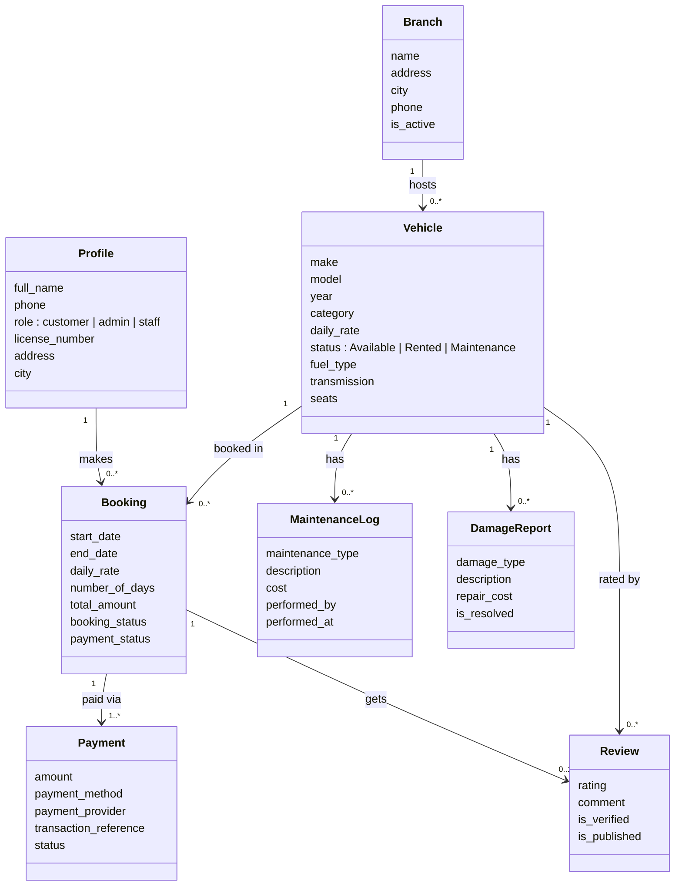
```mermaid
classDiagram
    class Profile {
        full_name
        phone
        role : customer | admin | staff
        license_number
        address
        city
    }

    class Branch {
        name
        address
        city
        phone
        is_active
    }

    class Vehicle {
        make
        model
        year
        category
        daily_rate
        status : Available | Rented | Maintenance
        fuel_type
        transmission
        seats
    }

    class Booking {
        start_date
        end_date
        daily_rate
        number_of_days
        total_amount
        booking_status
        payment_status
    }

    class Payment {
        amount
        payment_method
        payment_provider
        transaction_reference
        status
    }

    class Review {
        rating
        comment
        is_verified
        is_published
    }

    class MaintenanceLog {
        maintenance_type
        description
        cost
        performed_by
        performed_at
    }

    class DamageReport {
        damage_type
        description
        repair_cost
        is_resolved
    }

    Profile "1" --> "0..*" Booking : makes
    Vehicle "1" --> "0..*" Booking : booked in
    Branch "1" --> "0..*" Vehicle : hosts
    Booking "1" --> "1..*" Payment : paid via
    Booking "1" --> "0..1" Review : gets
    Vehicle "1" --> "0..*" Review : rated by
    Vehicle "1" --> "0..*" MaintenanceLog : has
    Vehicle "1" --> "0..*" DamageReport : has
```

---

## 8. Customer Flow — Sequence Diagrams

### 8.1 Browse and Book a Vehicle

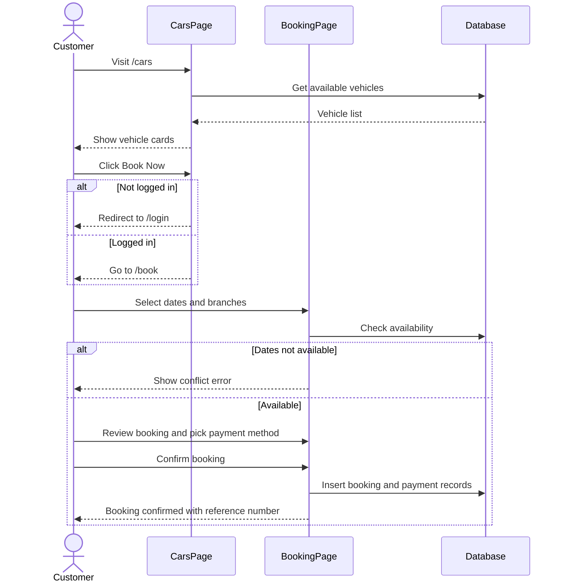
```mermaid
sequenceDiagram
    actor Customer
    participant CarsPage
    participant BookingPage
    participant Database

    Customer->>CarsPage: Visit /cars
    CarsPage->>Database: Get available vehicles
    Database-->>CarsPage: Vehicle list
    CarsPage-->>Customer: Show vehicle cards

    Customer->>CarsPage: Click Book Now
    alt Not logged in
        CarsPage-->>Customer: Redirect to /login
    else Logged in
        CarsPage-->>Customer: Go to /book
    end

    Customer->>BookingPage: Select dates and branches
    BookingPage->>Database: Check availability
    alt Dates not available
        BookingPage-->>Customer: Show conflict error
    else Available
        Customer->>BookingPage: Review booking and pick payment method
        Customer->>BookingPage: Confirm booking
        BookingPage->>Database: Insert booking and payment records
        BookingPage-->>Customer: Booking confirmed with reference number
    end
```

### 8.2 View and Cancel a Booking

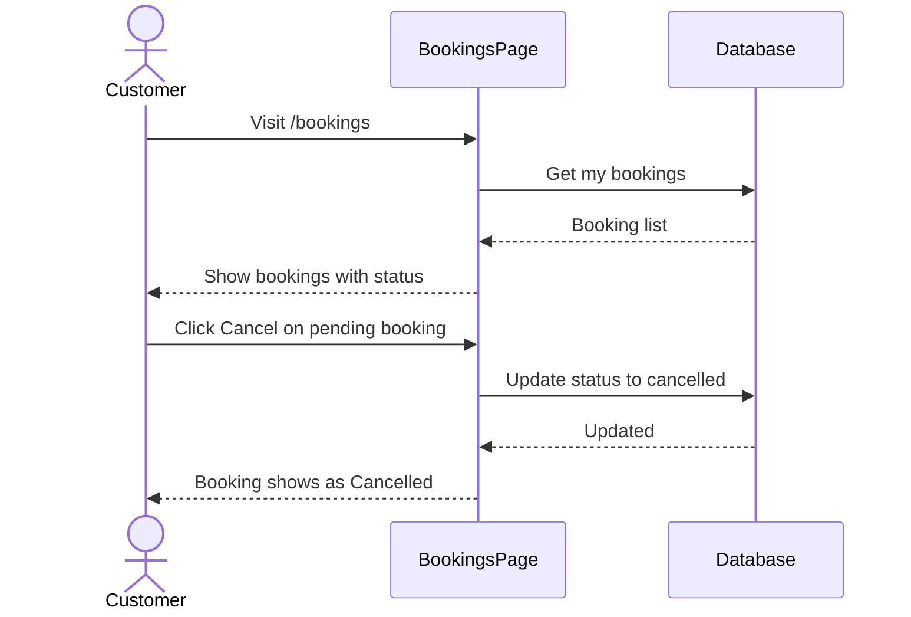
```mermaid
sequenceDiagram
    actor Customer
    participant BookingsPage
    participant Database

    Customer->>BookingsPage: Visit /bookings
    BookingsPage->>Database: Get my bookings
    Database-->>BookingsPage: Booking list
    BookingsPage-->>Customer: Show bookings with status

    Customer->>BookingsPage: Click Cancel on pending booking
    BookingsPage->>Database: Update status to cancelled
    Database-->>BookingsPage: Updated
    BookingsPage-->>Customer: Booking shows as Cancelled
```

### 8.3 Leave a Review

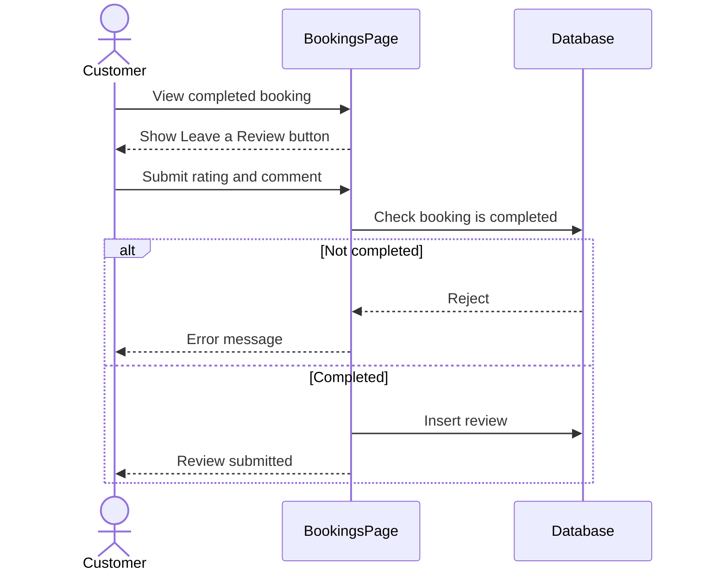
```mermaid
sequenceDiagram
    actor Customer
    participant BookingsPage
    participant Database

    Customer->>BookingsPage: View completed booking
    BookingsPage-->>Customer: Show Leave a Review button
    Customer->>BookingsPage: Submit rating and comment
    BookingsPage->>Database: Check booking is completed
    alt Not completed
        Database-->>BookingsPage: Reject
        BookingsPage-->>Customer: Error message
    else Completed
        BookingsPage->>Database: Insert review
        BookingsPage-->>Customer: Review submitted
    end
```

---

## 9. Admin Flow — Sequence Diagrams

### 9.1 Admin Booking Approval Workflow

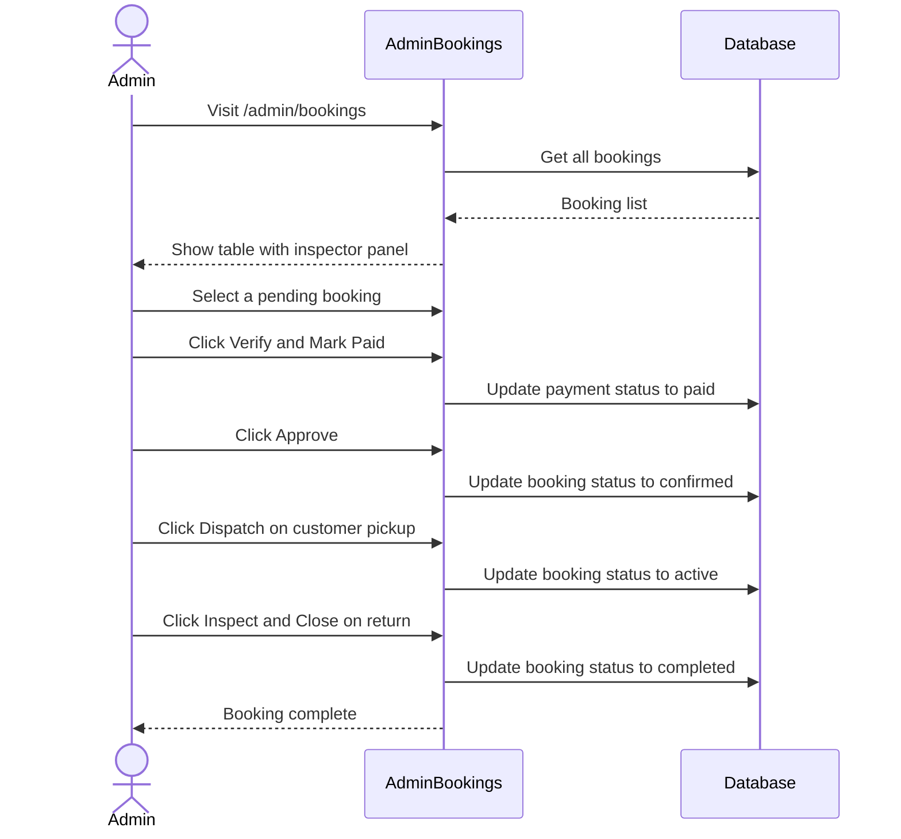
```mermaid
sequenceDiagram
    actor Admin
    participant AdminBookings
    participant Database

    Admin->>AdminBookings: Visit /admin/bookings
    AdminBookings->>Database: Get all bookings
    Database-->>AdminBookings: Booking list
    AdminBookings-->>Admin: Show table with inspector panel

    Admin->>AdminBookings: Select a pending booking
    Admin->>AdminBookings: Click Verify and Mark Paid
    AdminBookings->>Database: Update payment status to paid

    Admin->>AdminBookings: Click Approve
    AdminBookings->>Database: Update booking status to confirmed

    Admin->>AdminBookings: Click Dispatch on customer pickup
    AdminBookings->>Database: Update booking status to active

    Admin->>AdminBookings: Click Inspect and Close on return
    AdminBookings->>Database: Update booking status to completed
    AdminBookings-->>Admin: Booking complete
```

### 9.2 Fleet Management

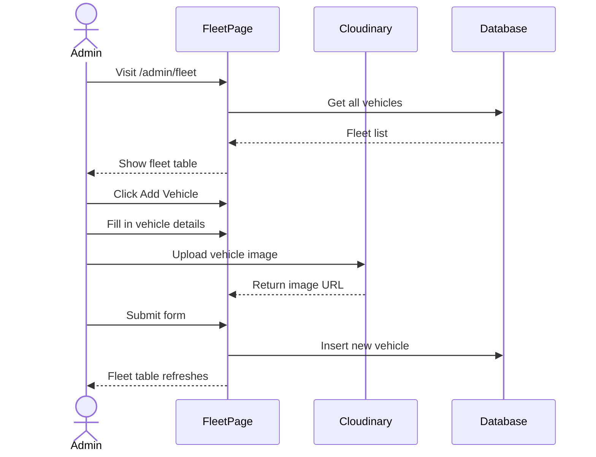
```mermaid
sequenceDiagram
    actor Admin
    participant FleetPage
    participant Cloudinary
    participant Database

    Admin->>FleetPage: Visit /admin/fleet
    FleetPage->>Database: Get all vehicles
    Database-->>FleetPage: Fleet list
    FleetPage-->>Admin: Show fleet table

    Admin->>FleetPage: Click Add Vehicle
    Admin->>FleetPage: Fill in vehicle details
    Admin->>Cloudinary: Upload vehicle image
    Cloudinary-->>FleetPage: Return image URL
    Admin->>FleetPage: Submit form
    FleetPage->>Database: Insert new vehicle
    FleetPage-->>Admin: Fleet table refreshes
```

### 9.3 Customer Management

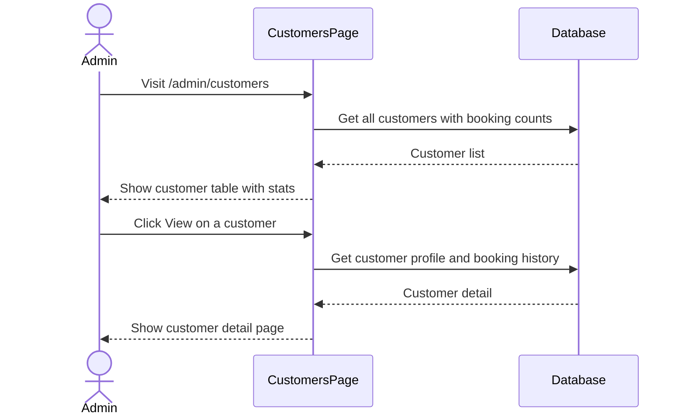
```mermaid
sequenceDiagram
    actor Admin
    participant CustomersPage
    participant Database

    Admin->>CustomersPage: Visit /admin/customers
    CustomersPage->>Database: Get all customers with booking counts
    Database-->>CustomersPage: Customer list
    CustomersPage-->>Admin: Show customer table with stats

    Admin->>CustomersPage: Click View on a customer
    CustomersPage->>Database: Get customer profile and booking history
    Database-->>CustomersPage: Customer detail
    CustomersPage-->>Admin: Show customer detail page
```

---

## 10. Booking Flow — Step by Step

The complete end-to-end booking flow for a logged-in customer:

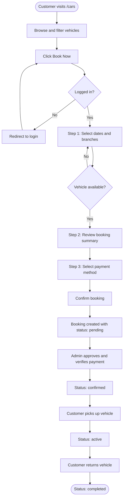
```mermaid
flowchart TD
    A([Customer visits /cars]) --> B[Browse and filter vehicles]
    B --> C[Click Book Now]
    C --> D{Logged in?}
    D -- No --> E[Redirect to login]
    E --> C
    D -- Yes --> F[Step 1: Select dates and branches]
    F --> G{Vehicle available?}
    G -- No --> F
    G -- Yes --> H[Step 2: Review booking summary]
    H --> I[Step 3: Select payment method]
    I --> J[Confirm booking]
    J --> K[Booking created with status: pending]
    K --> L[Admin approves and verifies payment]
    L --> M[Status: confirmed]
    M --> N[Customer picks up vehicle]
    N --> O[Status: active]
    O --> P[Customer returns vehicle]
    P --> Q([Status: completed])
```

### Booking Status Transitions

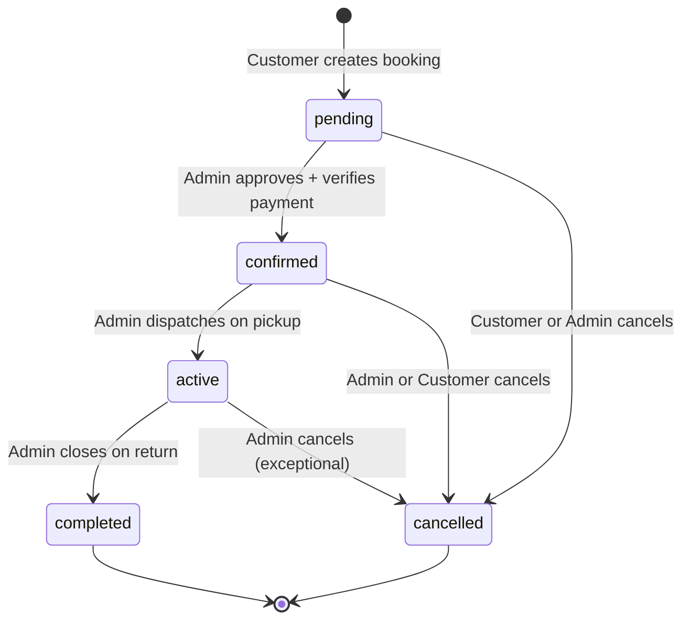
```mermaid
stateDiagram-v2
    [*] --> pending : Customer creates booking
    pending --> confirmed : Admin approves + verifies payment
    pending --> cancelled : Customer or Admin cancels
    confirmed --> active : Admin dispatches on pickup
    confirmed --> cancelled : Admin or Customer cancels
    active --> completed : Admin closes on return
    active --> cancelled : Admin cancels (exceptional)
    completed --> [*]
    cancelled --> [*]
```

### Payment Status Transitions

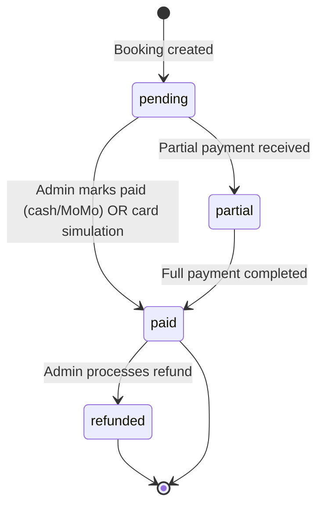
```mermaid
stateDiagram-v2
    [*] --> pending : Booking created
    pending --> paid : Admin marks paid (cash/MoMo) OR card simulation
    pending --> partial : Partial payment received
    partial --> paid : Full payment completed
    paid --> refunded : Admin processes refund
    refunded --> [*]
    paid --> [*]
```

---

## 11. Database Schema

### Entity Relationship Diagram

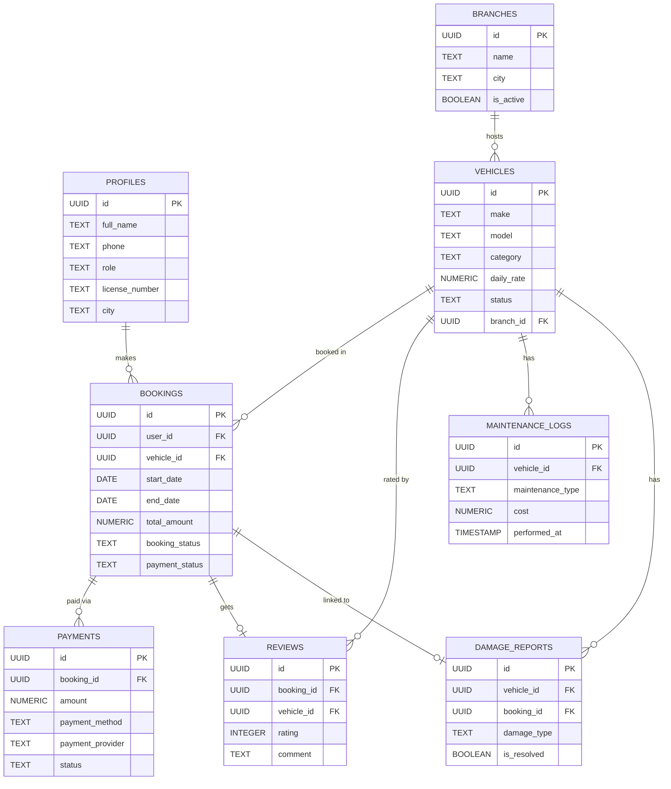
```mermaid
erDiagram
    PROFILES {
        UUID id PK
        TEXT full_name
        TEXT phone
        TEXT role
        TEXT license_number
        TEXT city
    }

    BRANCHES {
        UUID id PK
        TEXT name
        TEXT city
        BOOLEAN is_active
    }

    VEHICLES {
        UUID id PK
        TEXT make
        TEXT model
        TEXT category
        NUMERIC daily_rate
        TEXT status
        UUID branch_id FK
    }

    BOOKINGS {
        UUID id PK
        UUID user_id FK
        UUID vehicle_id FK
        DATE start_date
        DATE end_date
        NUMERIC total_amount
        TEXT booking_status
        TEXT payment_status
    }

    PAYMENTS {
        UUID id PK
        UUID booking_id FK
        NUMERIC amount
        TEXT payment_method
        TEXT payment_provider
        TEXT status
    }

    REVIEWS {
        UUID id PK
        UUID booking_id FK
        UUID vehicle_id FK
        INTEGER rating
        TEXT comment
    }

    MAINTENANCE_LOGS {
        UUID id PK
        UUID vehicle_id FK
        TEXT maintenance_type
        NUMERIC cost
        TIMESTAMP performed_at
    }

    DAMAGE_REPORTS {
        UUID id PK
        UUID vehicle_id FK
        UUID booking_id FK
        TEXT damage_type
        BOOLEAN is_resolved
    }

    PROFILES ||--o{ BOOKINGS : "makes"
    VEHICLES ||--o{ BOOKINGS : "booked in"
    BRANCHES ||--o{ VEHICLES : "hosts"
    BOOKINGS ||--o{ PAYMENTS : "paid via"
    BOOKINGS ||--o| REVIEWS : "gets"
    VEHICLES ||--o{ REVIEWS : "rated by"
    VEHICLES ||--o{ MAINTENANCE_LOGS : "has"
    VEHICLES ||--o{ DAMAGE_REPORTS : "has"
    BOOKINGS ||--o| DAMAGE_REPORTS : "linked to"
```

### Database Triggers & Functions

| Function | Trigger | Purpose |
|---|---|---|
| `handle_new_user()` | AFTER INSERT on auth.users | Auto-creates profile row with role='customer' |
| `check_booking_overlap()` | BEFORE INSERT/UPDATE on bookings | Prevents double-booking on same dates |
| `update_updated_at_column()` | BEFORE UPDATE on all tables | Auto-sets updated_at timestamp |
| `get_vehicle_rating(UUID)` | Called on demand | Returns average rating + review count |
| `is_vehicle_available(UUID, DATE, DATE)` | Called on demand | Returns boolean availability check |

### Database Views

| View | Purpose |
|---|---|
| `vehicles_with_ratings` | Joins vehicles with aggregated ratings from reviews |
| `booking_summary` | Joins bookings with customer name, vehicle name, and branch names for admin display |

---

## 12. Application Routes

### Public Routes (No Authentication Required)

| Route | Page | Description |
|---|---|---|
| `/` | Landing Page | Hero section, featured 3 available vehicles, company stats, why-us section |
| `/cars` | Vehicle Catalogue | Full fleet with search, category filter, fuel type filter, price range, sorting |
| `/about` | About Page | Company information |
| `/contact` | Contact Form | Submit inquiry form (name, email, phone, subject, message) |

### Authentication Routes

| Route | Page | Description |
|---|---|---|
| `/login` | Login Form | Email + password login with role-based redirect |
| `/register` | Register Form | Two-step: PersonalInfoStep + DocumentVerificationStep |
| `/verify-email` | Email Verification | Enter code to confirm email address |
| `/verify-email-sent` | Verification Sent | Confirmation page after registration |
| `/auth/callback` | Auth Callback | Supabase callback URL after email link click |

### Customer Routes (Requires Authentication)

| Route | Page | Description |
|---|---|---|
| `/(customer)/profile` | Profile Settings | Three tabs: Personal Info, Identity & Licensing, Security |
| `/(customer)/bookings` | My Bookings | All own bookings with status filter, cancel action |
| `/(customer)/book` | Booking Wizard | 4-step booking creation process |

### Admin Routes (Requires admin or staff role)

| Route | Page | Description |
|---|---|---|
| `/admin/dashboard` | Admin Dashboard | Revenue chart, fleet status, recent bookings, key metrics |
| `/admin/fleet` | Fleet Management | Add / edit / deactivate vehicles, Cloudinary image upload |
| `/admin/bookings` | Bookings Inspector | Full booking table + split-panel inspector with approval controls |
| `/admin/customers` | Customer Management | Customer list with stats, search, view customer detail |
| `/admin/staff` | Staff Management | List staff members, update roles |
| `/admin/settings` | System Settings | Company profile, branch management |
| `/admin/messages` | Contact Messages | Inbox for contact form submissions |
| `/admin/reports` | Reports | Revenue analytics |

---

## 13. Payment Methods

Three payment methods are currently implemented in the UI and recorded in the `payments` table.

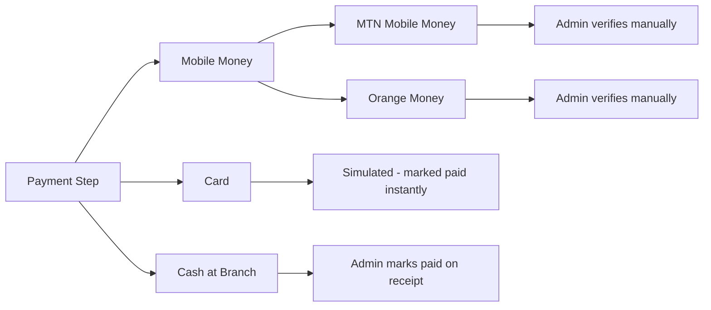
```mermaid
flowchart LR
    PM[Payment Step] --> Card[Card]
    PM --> MoMo[Mobile Money]
    PM --> Cash[Cash at Branch]

    MoMo --> MTN[MTN Mobile Money]
    MoMo --> Orange[Orange Money]

    Card --> C1[Simulated - marked paid instantly]
    MTN --> M1[Admin verifies manually]
    Orange --> O1[Admin verifies manually]
    Cash --> CA1[Admin marks paid on receipt]
```

| Method | Provider Field | Initial Payment Status | Verified By |
|---|---|---|---|
| Card | — | paid (simulated) | Automatic (mock) |
| MTN Mobile Money | "MTN Mobile Money" | pending | Admin manually |
| Orange Money | "Orange Money" | pending | Admin manually |
| Cash | — | pending | Admin on receipt |

---

## 14. Future Scope — Payment Integration

### 14.1 MTN Mobile Money (Direct REST Integration)

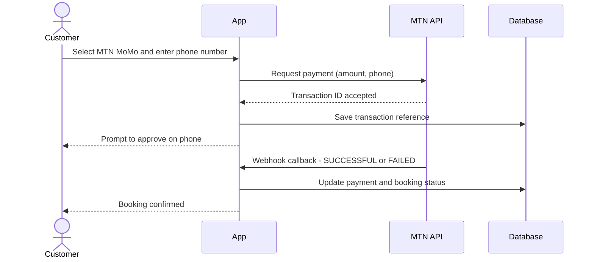
```mermaid
sequenceDiagram
    actor Customer
    participant App
    participant MTN API
    participant Database

    Customer->>App: Select MTN MoMo and enter phone number
    App->>MTN API: Request payment (amount, phone)
    MTN API-->>App: Transaction ID accepted
    App->>Database: Save transaction reference
    App-->>Customer: Prompt to approve on phone
    MTN API->>App: Webhook callback - SUCCESSFUL or FAILED
    App->>Database: Update payment and booking status
    App-->>Customer: Booking confirmed
```

### 14.2 Orange Money (Web Redirect)

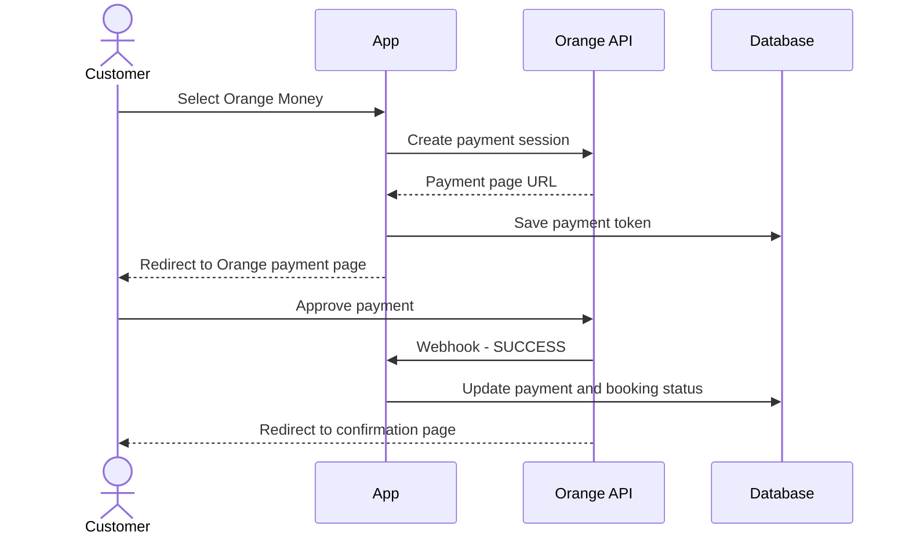
```mermaid
sequenceDiagram
    actor Customer
    participant App
    participant Orange API
    participant Database

    Customer->>App: Select Orange Money
    App->>Orange API: Create payment session
    Orange API-->>App: Payment page URL
    App->>Database: Save payment token
    App-->>Customer: Redirect to Orange payment page
    Customer->>Orange API: Approve payment
    Orange API->>App: Webhook - SUCCESS
    App->>Database: Update payment and booking status
    Orange API-->>Customer: Redirect to confirmation page
```

### 14.3 CamPay Aggregator (MTN and Orange unified)

```mermaid
sequenceDiagram
    actor Customer
    participant App
    participant CamPay
    participant Database

    Customer->>App: Select Mobile Money (any provider)
    App->>CamPay: Initiate collection (amount, phone)
    CamPay-->>App: Reference and USSD prompt
    App->>Database: Save transaction reference
    App-->>Customer: Approve USSD on phone
    CamPay->>App: Webhook - SUCCESSFUL or FAILED
    App->>Database: Update payment and booking status
    App-->>Customer: Booking confirmed
```

### 14.4 Stripe (International Card Payments)

```mermaid
sequenceDiagram
    actor Customer
    participant App
    participant Stripe
    participant Database

    Customer->>App: Select Card Payment
    App->>Stripe: Load card input widget
    Customer->>Stripe: Enter card details
    Stripe-->>App: Payment method token
    App->>Stripe: Create and confirm payment intent
    Stripe->>App: Webhook - payment_intent.succeeded
    App->>Database: Update payment and booking status
    App-->>Customer: Booking confirmed
```

### Summary of Future Payment Integrations

| Provider | Coverage | Method | Integration Type |
|---|---|---|---|
| MTN Mobile Money | Cameroon, CEMAC | Direct REST API | Push USSD prompt to customer phone |
| Orange Money | Cameroon, CEMAC | Hosted redirect page | Redirect customer to Orange page |
| CamPay | Cameroon (MTN + Orange) | Aggregator REST API | Single API for both operators |
| Stripe | International | Card (Visa/Mastercard) | Stripe Elements frontend + webhook |

---

## How to Use This Document

This document is structured to support a final year project submission. Each section maps to a standard software engineering deliverable:

- **Section 1–2** → Introduction and technology chapters
- **Section 3** → System architecture diagram (Chapter: Design)
- **Section 4** → Authentication design (Chapter: Security)
- **Section 5** → Access control design (Chapter: Security / Design)
- **Section 6** → Use Case diagram (Chapter: Requirements)
- **Section 7** → Class diagram (Chapter: Design)
- **Section 8–9** → Sequence diagrams (Chapter: Design / Implementation)
- **Section 10** → Activity / flowchart (Chapter: Implementation)
- **Section 11** → Database design with ERD (Chapter: Database Design)
- **Section 12** → System features and modules (Chapter: Implementation)
- **Section 13** → Payment module (Chapter: Implementation)
- **Section 14** → Future scope (Chapter: Conclusion / Future Work)

All Mermaid diagrams in this document can be rendered directly in:
- GitHub / GitLab markdown preview
- VS Code with the Mermaid Preview extension
- Notion (paste as code block with language `mermaid`)
- draw.io (import from Mermaid)
- Any tool supporting the Mermaid.js specification

---

*Generated for Car Rental System — Final Year Project Documentation*
